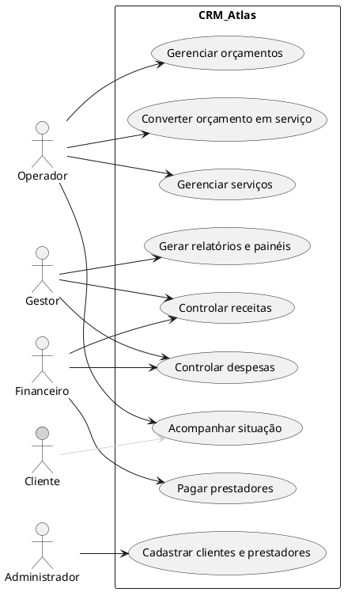
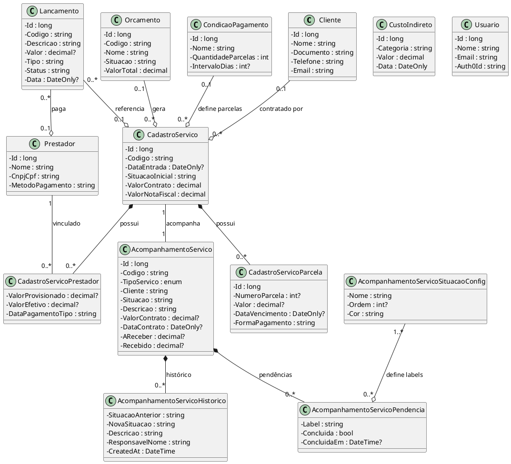
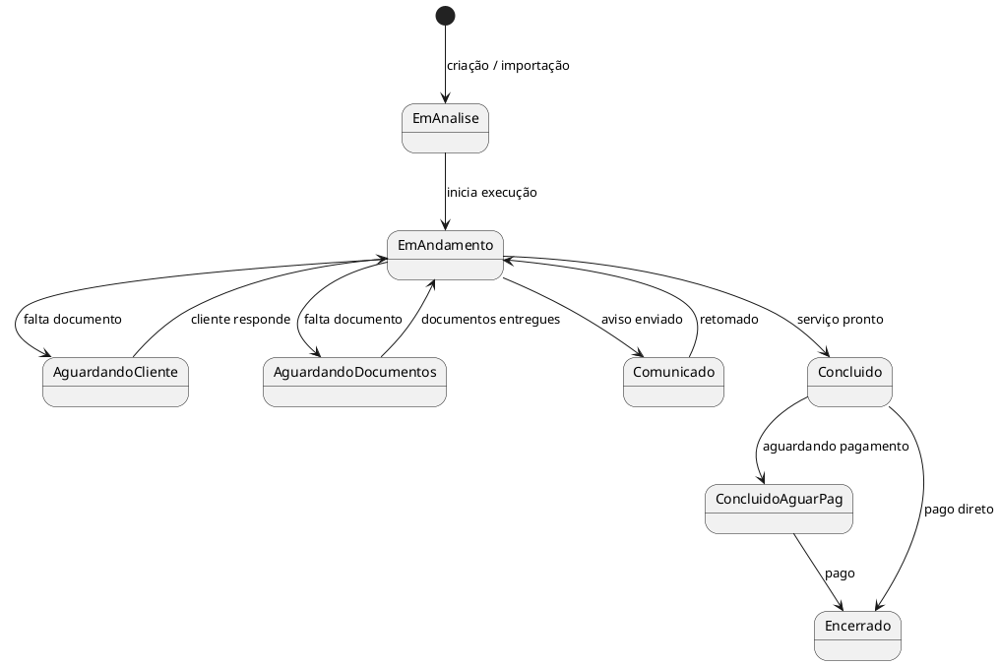
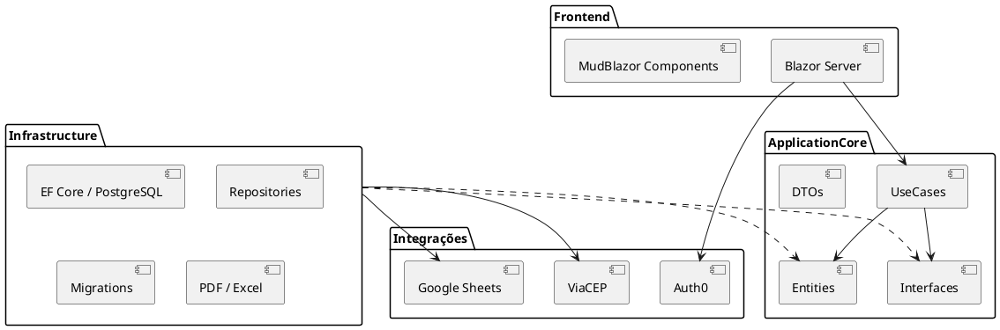

# UML do CRM Atlas — Visão Clara e Humanizada

Este documento resume a arquitetura e o domínio do **CRM Atlas** usando UML. O objetivo é que qualquer pessoa consiga entender o sistema sem precisar mergulhar no código.

---

## 1. O que é o CRM Atlas?

O CRM Atlas é um sistema de gestão de engenharia. Ele conecta três mundos:

- **Operacional**: acompanhamento de serviços (AVCB, CLCB, processos administrativos e obras), histórico de mudanças e pendências.
- **Financeiro**: orçamentos, contratos, parcelas, recebimentos, custos diretos/indiretos e pagamento de prestadores.
- **Pessoas**: clientes, prestadores e usuários.

---

## 2. Atores

- **Gestor**: vê painéis, acompanha carteira e resultados.
- **Operador**: cadastra orçamentos, converte em serviço, muda situação e observações.
- **Financeiro**: lança entradas, saídas, parcelas e pagamentos.
- **Administrador**: cadastra clientes, prestadores e usuários.
- **Cliente** (passivo): recebe acompanhamento, mas não interage diretamente no sistema.

---

## 3. Diagrama de Classes — Domínio Principal

A classe central do negócio é o `AcompanhamentoServico`. Tudo gira em torno dela: contrato, histórico de situações, pendências e vínculo com prestadores.

### Principais relações

- **Cliente e CadastroServico**: um cliente pode ter vários serviços; um serviço pertence a um cliente.
- **Orçamento e CadastroServico**: um orçamento, ao ser aprovado, vira um serviço.
- **CadastroServico e AcompanhamentoServico**: são duas faces do mesmo processo — uma é o contrato/financeiro; a outra é o acompanhamento operacional.
- **AcompanhamentoServico, Histórico e Pendências**: toda mudança de situação gera um histórico; cada situação pode ter uma lista de pendências.
- **Lançamento e CadastroServico/Prestador**: os lançamentos financeiros amarram entradas/saídas a serviços e prestadores.

---

## 4. Diagrama de Estados — Serviço

O `AcompanhamentoServico` passa por situações ao longo do tempo. As situações são configuráveis por tipo de serviço.

- O fluxo não é rígido: o operador pode mudar a situação conforme a realidade.
- Cada mudança grava um **histórico** com a situação anterior, a nova, quem fez e uma observação.

---

## 5. Diagrama de Pacotes — Arquitetura em Camadas

- **Frontend**: Blazor Server com MudBlazor. Não tem regras de negócio; só chama os casos de uso.
- **ApplicationCore**: regras de negócio, entidades e contratos (interfaces).
- **Infrastructure**: acesso a dados, migrations, geração de documentos e integrações externas.
- **Integrações**: Auth0 (login), ViaCEP (endereço) e importação de planilhas.

---

## 6. Dicas para ler os diagramas

- As setas com `*` ou `0..*` significam "muitos". Uma bolinha vazia `o` indica agregação (o filho pode existir sozinho). Um losango cheio `*` indica composição (se o pai morre, o filho também morre, como histórico e pendências de um serviço).
- O `AcompanhamentoServico` é o coração do sistema. Quase todas as consultas e relatórios partem dele.
- `CadastroServico` e `AcompanhamentoServico` compartilham o mesmo `Codigo` na prática, mas um cuida do financeiro/contrato e o outro da operação.

---

## 7. Resumo em uma frase

> O CRM Atlas liga **pessoas** (clientes e prestadores), **contratos** (serviços e orçamentos) e **movimentações** (receitas, despesas e histórico operacional) em uma única base, permitindo acompanhar a fila de trabalho, a carteira a receber e o resultado financeiro.
